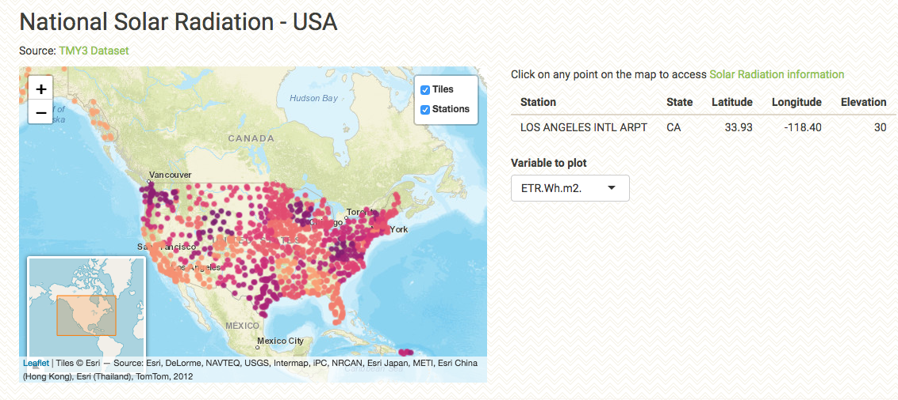
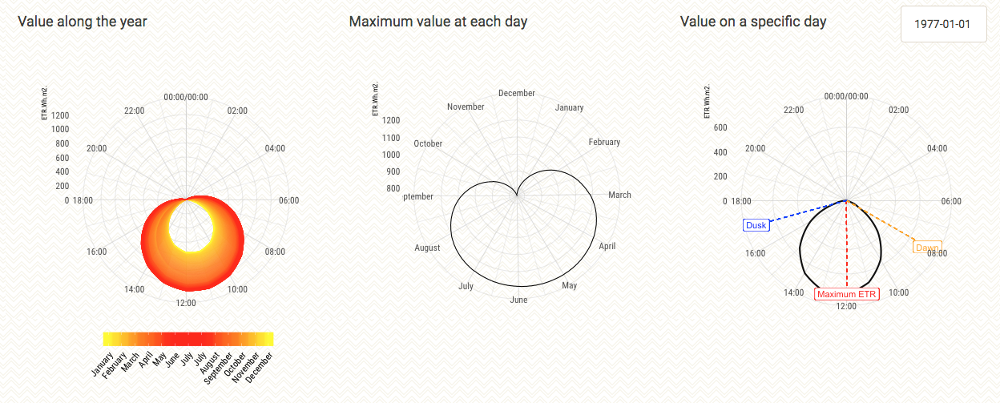

# National Solar Radiation Data Base Visualization

This repository contains the code for the [DataViz Battle for the month of March 2019](https://www.reddit.com/r/dataisbeautiful/comments/axknia/battle_dataviz_battle_for_the_month_of_march_2019/)

Every month, the subreddit [r/dataisbeautiful/](https://www.reddit.com/r/dataisbeautiful/) challenges people across the globe to work with a new dataset. These challenges range in difficulty, filesize, and analysis required. What I love about this competition is the freedom it gives the participants to visualize the dataset. As a matter of fact, this is the only rule you need to follow:

> Use the dataset. Work with the data, perform the analysis, and generate a visual. It is entirely up to each participant to decide how to present the visual.

### DataViz

At first, I did an initial exploration of the dataset, looking for any interesting 

